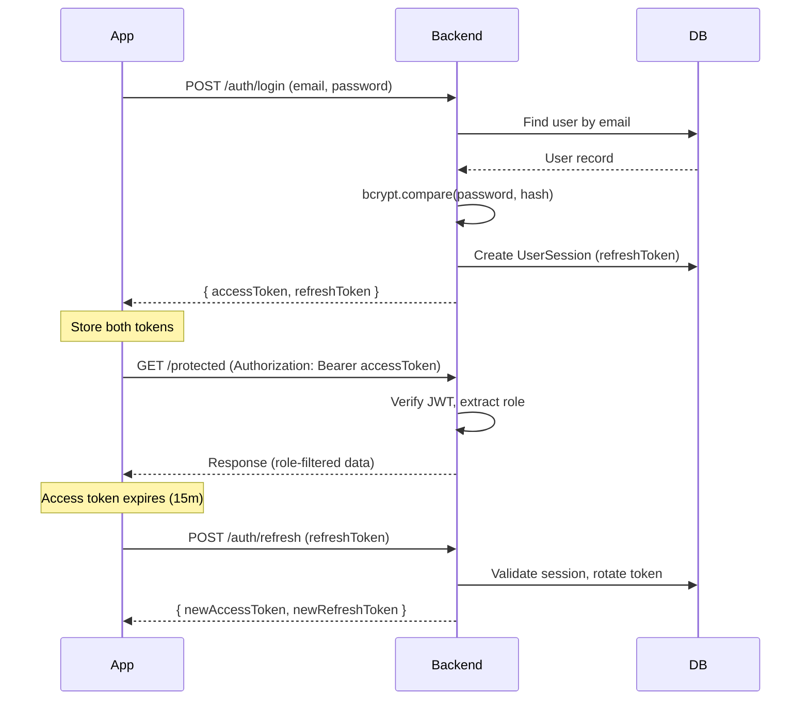

# Data Flow

---

## 1. Authentication Flow



---

## 2. Loan Application Data Flow

```
Employee submits via App
        │
        ▼
POST /loan-applications
        │
        ├─ Eligibility check (EligibilityService)
        │    └─ salary, %, active applications, cooldown
        │
        ├─ Pricing snapshot (PricingService.computeSnapshot)
        │    └─ Freeze: interestRate, interestFreeThreshold,
        │              processingFeeRate, gstRate
        │
        ├─ Recovery date computed (PricingService.resolveRecoveryDate)
        │    └─ Uses employer's payrollDay + payrollCutoffDate
        │
        └─ LoanApplication created (status: SUBMITTED)
                │
                ▼
        Employer approves
        (POST /loan-applications/:id/employer-approve)
                │
                ├─ employerApprovedAmount recorded
                └─ LoanApplicationFee created (₹175, PENDING_PAYMENT)
                        │
                        ▼
        Employee pays ₹175 (Razorpay)
        (POST /platform-fees/.../initiate-payment)
                │
                ├─ Razorpay Order created
                ├─ PaymentOrder record saved
                └─ Employee completes payment in Razorpay checkout
                        │
                        ▼
        Razorpay webhook fires (payment.captured)
        (POST /webhooks/razorpay)
                │
                ├─ Signature verified
                ├─ LoanApplicationFee status → PAID
                └─ LoanApplication status → READY_FOR_DISBURSAL
                        │
                        ▼
        Admin approves + initiates disbursal
        (POST /disbursals → POST /disbursals/:id/disburse)
                │
                ├─ Disbursal record created
                ├─ Bank details frozen on Disbursal
                ├─ PricingService.computeRepaymentBreakdown called
                │    └─ Uses frozen snapshot from LoanApplication
                │    └─ Computes: principal, interest, processingFee, GST, total
                ├─ Repayment record created
                └─ LoanApplication status → REPAYMENT_SCHEDULED
```

---

## 3. Repayment & Settlement Data Flow

```
At payroll date:

Admin
  └─ Generates EmployerSettlement
       └─ Queries all Repayments with status SCHEDULED + dueDate in cycle
       └─ Creates SettlementLineItem for each (frozen amounts)
       └─ Aggregates totals onto EmployerSettlement
       └─ Status: DRAFT → GENERATED

  └─ Sends settlement report to employer (email + PDF)

Employer
  └─ Deducts amounts from employee payroll
  └─ Pays MobPae via NEFT/RTGS
  └─ Shares bank reference

Admin
  └─ Records SettlementPayment (amount, bankReference, date)
  └─ Marks EmployerSettlement → PAID (or PARTIALLY_PAID)
  └─ Marks each Repayment → PAID
  └─ LoanApplication status → REPAID
```

---

## 4. File (KYC) Data Flow

```
Employee App
  └─ Selects file (image/PDF)
  └─ POST /kyc-documents (multipart/form-data)
       │
       ▼
  FilesService
  └─ Validates file type + size
  └─ Uploads to Cloudflare R2
       Key: kyc/{employeeId}/{documentType}/{uuid}.{ext}
  └─ Saves file key (not URL) in DB: KycDocument.filePath

Admin Panel (viewing KYC)
  └─ GET /kyc-documents/employee/:employeeId
       └─ Returns filePath (R2 key)
  └─ GET /files/signed-url?key={filePath}
       └─ Backend generates S3 presigned URL (15-min expiry)
       └─ Frontend renders file from signed URL
```

---

## 5. Interest Calculation Data Flow

```
At submission time:
  PricingService.computeSnapshot(salary, productConfig, employerConfig)
    └─ Computes interestFreeThreshold = min(salary × platformPct, platformMax)
    └─ Freezes: snapshotAnnualInterestRate, snapshotInterestFreeThreshold,
                snapshotProcessingFeeRate, snapshotGstRate,
                snapshotInterestDays, snapshotRecoveryDate

At disbursal time:
  PricingService.computeRepaymentBreakdown(disbursedAmount, snapshot)
    └─ interestFreeAmount    = min(principal, interestFreeThreshold)
    └─ interestBearingAmount = principal − interestFreeAmount
    └─ interestAmount        = interestBearingAmount × (annualRate/100) × (days/365)
    └─ processingFee         = principal × processingFeeRate
    └─ gstAmount             = (interest + fee) × gstRate
    └─ totalAmount           = principal + interest + fee + gst

These computed values are stored on the Repayment record and never recalculated.
```

---

## Key Design Decisions

### Snapshot Pattern
Every rate (interest, fee, GST) is frozen at submission time onto the `LoanApplication` table. This means: even if admin changes the product config later, existing applications are unaffected. The repayment amount a user agreed to at submission time never changes.

### Disbursal Bank Snapshot
Bank account details (account number, IFSC, name) are also frozen onto the `Disbursal` record at creation time. This ensures we always know exactly where money was sent, even if the employee later changes their bank account.

### Settlement Line Item Snapshot
`SettlementLineItem` freezes employee name, application number, and all amounts at settlement generation time. This makes settlement reports immutable — editing employee data later doesn't corrupt historical settlement records.
